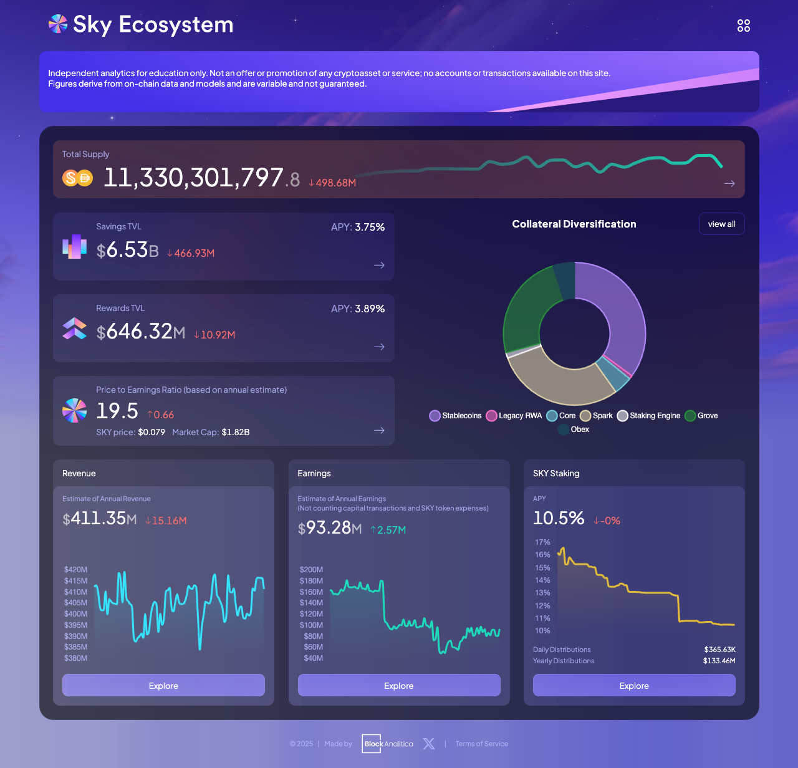
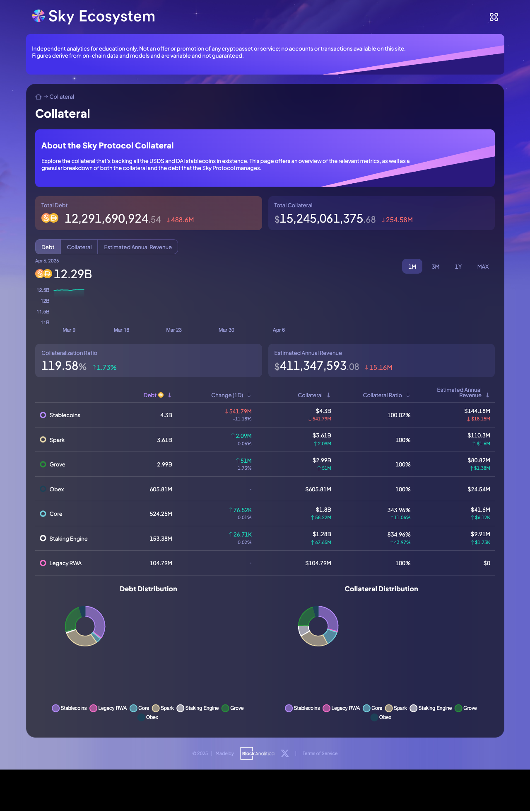
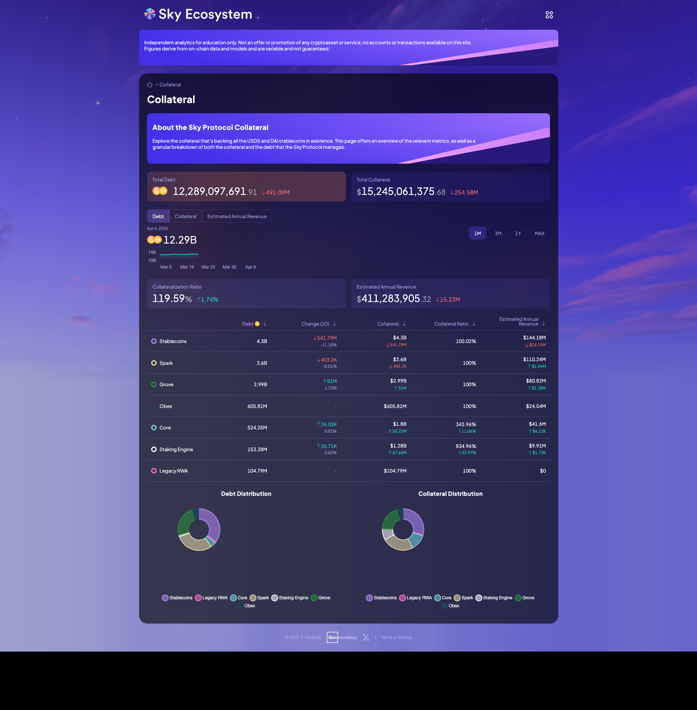
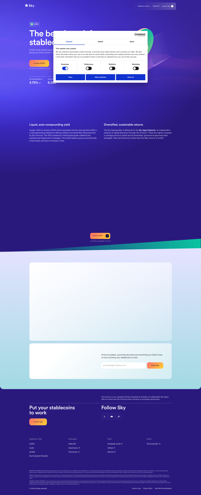

# Sky Protocol (formerly MakerDAO) — Due Diligence Report

**Date:** April 6, 2026
**Status:** Draft
**Related:** [Stablewatch DD](../stablewatch/README.md)

---

## 1. Protocol Overview

Sky Protocol (formerly MakerDAO) is a decentralized lending protocol that issues the USDS stablecoin (and legacy DAI). Users deposit collateral into vaults to mint USDS. The protocol generates revenue through stability fees, real-world asset allocations, and the Peg Stability Module.

The protocol rebranded from MakerDAO to Sky in August 2024.

| Metric | Value | Source |
|---|---|---|
| USDS supply | 8.08B | Etherscan API, `totalSupply()` on [0xdC035D45](https://etherscan.io/address/0xdC035D45d973E3EC169d2276DDab16f1e407384F) |
| DAI supply | 4.44B | Etherscan API, `totalSupply()` on [0x6B175474](https://etherscan.io/address/0x6B175474E89094C44Da98b954EedeAC495271d0F) |
| Combined supply | 12.52B | USDS + DAI |
| SKY token supply | 23.46B | Etherscan API, `totalSupply()` on [0x56072C95](https://etherscan.io/address/0x56072C95FAA701256059aa122697B133aDEd9279) |
| S&P Rating | B- (stable) | [S&P Global Ratings, Aug 7, 2025](https://www.spglobal.com/ratings/en/regulatory/article/-/view/sourceId/101639449) |
| Est. annual revenue | $411.35M | [info.skyeco.com](https://info.skyeco.com), Apr 6, 2026 |
| Total collateral | $15.25B | info.skyeco.com |
| Collateralization ratio | 119.58% | info.skyeco.com |

---

## 2. sUSDS — Savings Token Mechanism

sUSDS is a yield-bearing ERC-4626 token representing a deposit into the Sky Savings Rate (SSR).

### How it works (verified in smart contract)

Source code: [`SUsds.sol`](https://github.com/sky-ecosystem/sdai) (branch `susds`)
Proxy: [`0xa3931d71877C0E7a3148CB7Eb4463524FEc27fbD`](https://etherscan.io/address/0xa3931d71877C0E7a3148CB7Eb4463524FEc27fbD)
Implementation: [`0x4e7991e5C547ce825BdEb665EE14a3274f9F61e0`](https://etherscan.io/address/0x4e7991e5C547ce825BdEb665EE14a3274f9F61e0)

1. User calls `deposit(assets, receiver)` which transfers USDS into the contract via `usds.transferFrom()` and mints sUSDS shares at the current exchange rate: `shares = assets * RAY / chi`.

2. The `drip()` function accrues yield by computing `chi = _rpow(ssr, elapsed) * chi / RAY`. This exponential compounding increases `chi` monotonically. New USDS is minted via `vat.suck()` to back the increased value.

3. User calls `withdraw()` or `redeem()` at any time. There are no lock-ups, fees, timelocks, or cooldowns in the contract. The Sky Protocol documentation states: *"No fees assessed. Fees cannot be enabled on this route in the future."*

4. The contract uses the ERC-1822 UUPS upgradeable proxy pattern via OpenZeppelin's `UUPSUpgradeable`. The `_authorizeUpgrade()` function is gated by `auth` (governance).

### On-chain state (April 6, 2026)

| Parameter | Value | Contract call |
|---|---|---|
| totalAssets | 6,275,000,000 USDS (6.28B) | `totalAssets()` = `0x14469f9b5a39553988cf4e82` |
| totalSupply | 5,745,000,000 sUSDS (5.75B) | `totalSupply()` = `0x1290c7146f8eae4636af4f6d` |
| chi | 1.092348 (RAY-scaled) | `chi()` = `0x038791d3e44ee5379e3af68b` |
| Exchange rate | 1 sUSDS = 1.092348 USDS | chi / RAY |
| APY | 3.75% | [sky.money/susds](https://sky.money/susds), Aavescan, Twigscan |

### What this means

- **77.6% of all USDS** is locked in sUSDS (6.28B / 8.08B). This creates significant concentration — a mass unstaking event would flood the market with USDS.
- The exchange rate of 1.092 means sUSDS has accrued ~9.2% yield since inception (September 2024). This is consistent with the rate trajectory (12.5% -> 3.75%).
- The yield is **governance-set**, not algorithmic. It is changed via executive votes on [vote.makerdao.com](https://vote.makerdao.com). Documented trajectory: 12.5% (Dec 6, 2024) -> 8.75% (Feb 6, 2025) -> 6.50% (Feb 21, 2025) -> 4.50% (Mar 20, 2025) -> 3.75% (current).

### Contract risk note

The contract is upgradeable (UUPS proxy). Governance can alter the contract's behavior, including potentially adding a freeze function. Sky founder Rune Christensen stated in August 2024: *"there will be no freeze function at launch, there will just be an upgrade ability"* ([InsideBitcoins, Aug 28, 2024](https://insidebitcoins.com/news/maker-co-founder-rune-christensen-dispels-freeze-function-rumors-ahead-of-usds-launch)). The freeze function does not exist today but could be added via governance vote.

---

## 3. Collateral Composition

Data from [info.skyeco.com/collateral](https://info.skyeco.com/collateral), April 6, 2026:

| Category | Debt | Collateral | Coll. Ratio | Est. Revenue/yr |
|---|---|---|---|---|
| Stablecoins (PSM) | $4.30B | $4.30B | 100.02% | $144.18M |
| Spark | $3.60B | $3.60B | 100% | $110.24M |
| Grove | $2.99B | $2.99B | 100% | $80.82M |
| Obex | $605.81M | $605.81M | 100% | $24.54M |
| Core (crypto vaults) | $524.25M | $1.80B | 343.96% | — |
| Staking Engine | $153.38M | $1.28B | 834.96% | — |
| Legacy RWA | $104.79M | $104.79M | 100% | $0 |
| **Total** | **$12.29B** | **$15.25B** | **119.58%** | **$411.35M** |

### PSM USDC balance (on-chain verification)

Contract: PSM Pocket [`0x37305B1cD40574E4C5Ce33f8e8306Be057fD7341`](https://etherscan.io/address/0x37305B1cD40574E4C5Ce33f8e8306Be057fD7341)
USDC token: [`0xA0b86991c6218b36c1d19D4a2e9Eb0cE3606eB48`](https://etherscan.io/address/0xA0b86991c6218b36c1d19D4a2e9Eb0cE3606eB48)

**Balance: $4,303,767,363.51 USDC (4.30B)** — verified via Etherscan API V2 `tokenbalance`.

### What this means

1. **USDC dependency: 34.4% of combined USDS+DAI supply ($4.30B / $12.52B) is backed by USDC** sitting in the PSM. If Circle (USDC issuer) were to freeze these funds, blacklist the PSM contract, or face regulatory action, over one-third of USDS's backing would be at risk. This is a circular dependency — a "decentralized" stablecoin significantly backed by a centralized one.

2. **Revenue concentration:** Stablecoins (PSM) generate $144.18M/yr (35% of total revenue). A portion of this comes from USDC deposits earning interest on Coinbase.

3. **Spark dominance:** Spark (an Aave v3 fork operated by Sky) holds $3.60B and generates $110.24M/yr — the second-largest revenue source. This is on-chain lending, subject to borrowing demand fluctuations.

4. **Grove RWA:** $2.99B allocated to Grove, a relatively new RWA allocation channel. This has diversified away from the previous concentration in BlockTower Andromeda. Legacy RWA is now $104.79M generating zero revenue.

5. **Overcollateralization only in crypto:** Core vaults are 344% collateralized, Staking Engine 835%. But Stablecoins, Spark, Grove, Obex, and Legacy RWA are all at ~100% — meaning any impairment in these categories directly impacts backing.

---

## 4. Revenue

| Metric | Value | Source |
|---|---|---|
| Annualized revenue (live) | $411.35M | info.skyeco.com, Apr 6, 2026 |
| Full-year 2025 actual | $338M | CryptoPolitan, Feb 11, 2026 |
| 2026 projection | $611.5M | [SFF press release, Feb 2, 2026](https://www.prnewswire.com/news-releases/302676628.html) |
| Annualized earnings | $93.28M | info.skyeco.com |
| P/E ratio | 19.5 | info.skyeco.com (based on SKY market cap $1.82B) |

Note: The commonly cited "$435M revenue" was an annualized run-rate as of December 15, 2025 ([SFF press release](https://www.einpresswire.com/article_print/875939937/)), not actual full-year revenue. Current run-rate is $411.35M — a decline from that peak.

### Q1 2025 loss

Sky posted a **$5M loss in Q1 2025** after a $31M profit in Q4 2024, caused by an unsustainably high 12.5% savings rate. Source: [CoinDesk, May 13, 2025](https://www.coindesk.com/zh/business/2025/05/13/defi-savings-protocol-sky-slumps-to-5m-loss), citing Steakhouse Financial report.

---

## 5. Governance Risks

### S&P assessment

S&P Global Ratings assigned Sky Protocol a **B- rating with stable outlook** on August 7, 2025 — the first credit rating for a DeFi protocol. Key findings:

- *"Governance of Sky Protocol remains effectively controlled by co-founder Rune Christensen due to low voter turnout"* — [The Defiant, Aug 12, 2025](https://thedefiant.io/news/research-and-opinion/s-and-p-sees-no-quick-fix-for-sky-protocol-s-weak-capital-and-centralization)
- *"Christensen owns just 9% of governance tokens"* but has outsized influence
- *"A better rating is highly unlikely within the next 12 months"*

### ECB Working Paper (March 2026)

[ECB Working Paper 3208](https://www.ecb.europa.eu/pub/pdf/scpwps/ecb.wp3208~051a880042.en.pdf) (March 26, 2026) found that in MakerDAO/Sky, Aave, Ampleforth, and Uniswap: *"the top 100 holders own over 80% of governance tokens."*

### February 2025 emergency vote

On February 18, 2025, an out-of-schedule executive vote was passed ([vote.makerdao.com](https://vote.makerdao.com/executive/template-executive-vote-out-of-schedule-executive-vote-risk-parameter-changes-february-18-2025)):

- Maximum Debt Ceiling: 20M -> 45M USDS
- Liquidation Ratio: 200% -> 125%
- GSM Pause Delay: 30h -> 18h
- Stability Fee: 12% -> 20%

Multiple sources ([Protos](https://protos.com/maker-dao-drama-flares-amid-proposal-to-tackle-governance-attack/), Chainflow) reported that critics including GFX Labs/PaperImperium were banned from governance forums during the vote. Sky has not confirmed or denied this.

### Aave removes USDS

On December 4, 2025, Aave governance approved removing USDS as collateral with 99.5% support ([Aave Governance Forum](https://governance.aave.com/t/arfc-remove-usds-as-collateral-and-increase-rf-across-all-aave-instances/23426), [Crypto-Economy](https://crypto-economy.com/aave-approves-removal-of-usds-as-collateral/)).

### Rebrand

The MakerDAO-to-Sky rebrand cost approximately $5M ([DL News, Oct 25, 2024](https://www.dlnews.com/articles/defi/maker-founder-blames-rebrand-flop-on-typical-defi-mistake/)). Christensen called it a *"typical DeFi mistake."* Governance tokens lost ~50% of value. A community vote to revert the rebrand was blocked by four whale entities controlling ~98% of votes ([The Block, Nov 8, 2024](https://www.theblock.co/post/325096)).

---

## 6. Regulatory Status

| Regulation | Status | Source |
|---|---|---|
| GENIUS Act (US) | Signed July 18, 2025. Requires CEO/CFO certification of reserves. Sky as a DAO cannot structurally comply. | [Greenberg Traurig](https://gtlaw.com/en/insights/2025/7/genius-act-enacted), [Latham & Watkins](https://www.lw.com/en/insights/2025/07/the-genius-act-of-2025) |
| MiCA (EU) | Requires authorized legal entity for e-money tokens. Sky has no such entity. | [21 Analytics](https://www.21analytics.co/blog/stablecoins-in-the-eu/) — Article 48 |
| US availability | sUSDS explicitly unavailable in the US | [sky.money/susds](https://sky.money/susds): *"Currently unavailable in the US"* |
| Reserve attestation | No independent CPA/auditor attestation (unlike USDC/Grant Thornton, USDT/BDO Italia) | [StableRegistry, Mar 12, 2026](https://stableregistry.com/research/usds-institutional-risk-assessment-2026/) |

---

## 7. Historical Incidents

| Incident | Date | Impact | Source |
|---|---|---|---|
| Black Thursday | Mar 12, 2020 | ETH -43%. At least 4 addresses exploited zero-bid auctions for $8.32M total. Protocol accrued $4-5.67M bad debt. Emergency MKR minting. | [NewsBTC](https://www.newsbtc.com/news/ethereum/ethereum-fell-43-percent-yesterday-worst-day-ever/), [Whiterabbit/Medium](https://medium.com/@whiterabbit_hq/black-thursday-for-makerdao-8-32-million-was-liquidated-for-0-dai-36b83cac56b6), [The Block](https://www.theblock.co/post/58606) |
| Liquidation 2.0 fix | May 2021 | Dutch auction system replaced English auctions | [MIP45](https://forum.makerdao.com/t/mip45-liquidations-2-0-liq-2-0-liquidation-system-redesign/6352) |
| Rebrand to Sky | Aug 2024 | ~$5M cost, SKY -50%, community backlash | [DL News, Oct 25, 2024](https://www.dlnews.com/articles/defi/maker-founder-blames-rebrand-flop-on-typical-defi-mistake/) |
| Emergency governance | Feb 2025 | Parameters changed overnight, critics banned | [vote.makerdao.com](https://vote.makerdao.com/executive/template-executive-vote-out-of-schedule-executive-vote-risk-parameter-changes-february-18-2025) |
| Q1 2025 loss | Q1 2025 | $5M loss from unsustainable 12.5% SSR | [CoinDesk, May 13, 2025](https://www.coindesk.com/zh/business/2025/05/13/defi-savings-protocol-sky-slumps-to-5m-loss) |
| Aave delists USDS | Dec 2025 | 99.5% vote to remove USDS as collateral | [Aave Governance](https://governance.aave.com/t/arfc-remove-usds-as-collateral-and-increase-rf-across-all-aave-instances/23426) |
| Steakhouse Financial breach | Mar 30, 2026 | Front-end phishing via OVH Cloud social engineering. No fund losses. | [Protos](https://protos.com/steakhouse-financial-front-end-breach/) |

---

## 8. Key Contracts

| Contract | Address | Notes |
|---|---|---|
| USDS token | [`0xdC035D45d973E3EC169d2276DDab16f1e407384F`](https://etherscan.io/address/0xdC035D45d973E3EC169d2276DDab16f1e407384F) | ERC-20 stablecoin |
| DAI token | [`0x6B175474E89094C44Da98b954EedeAC495271d0F`](https://etherscan.io/address/0x6B175474E89094C44Da98b954EedeAC495271d0F) | Legacy stablecoin |
| sUSDS (proxy) | [`0xa3931d71877C0E7a3148CB7Eb4463524FEc27fbD`](https://etherscan.io/address/0xa3931d71877C0E7a3148CB7Eb4463524FEc27fbD) | ERC-4626 / UUPS |
| sUSDS (impl) | [`0x4e7991e5C547ce825BdEb665EE14a3274f9F61e0`](https://etherscan.io/address/0x4e7991e5C547ce825BdEb665EE14a3274f9F61e0) | SUsds.sol |
| SKY token | [`0x56072C95FAA701256059aa122697B133aDEd9279`](https://etherscan.io/address/0x56072C95FAA701256059aa122697B133aDEd9279) | Governance token |
| PSM Pocket | [`0x37305B1cD40574E4C5Ce33f8e8306Be057fD7341`](https://etherscan.io/address/0x37305B1cD40574E4C5Ce33f8e8306Be057fD7341) | Holds $4.30B USDC |
| LitePSM | [`0xf6e72Db5454dd049d0788e411b06CfAF16853042`](https://etherscan.io/address/0xf6e72Db5454dd049d0788e411b06CfAF16853042) | PSM routing contract |

Source code: [github.com/sky-ecosystem/sdai](https://github.com/sky-ecosystem/sdai) (branch `susds`)

---

## 9. Risk Summary

| Risk | Severity | Evidence |
|---|---|---|
| Governance centralization | High | S&P B-, ECB paper, Feb 2025 emergency vote |
| USDC dependency | High | 34.4% of supply backed by USDC ($4.30B on-chain) |
| No independent reserve audit | High | StableRegistry assessment |
| Regulatory incompatibility | High | Cannot comply with GENIUS Act or MiCA structurally |
| Upgradeable contracts | Medium | UUPS proxy — governance can modify behavior |
| Yield sustainability | Medium | Proven unsustainable at higher levels (Q1 2025 loss) |
| Bank run exposure | Medium | 77.6% of USDS in sUSDS; PSM has finite USDC buffer |
| Revenue decline | Low-Medium | $411M current vs $435M Dec 2025 run-rate |

---

*Report prepared April 6, 2026. All on-chain data verified via Etherscan API V2. Dashboard data from info.skyeco.com.*
*See also: [Stablewatch DD](../stablewatch/README.md)*
