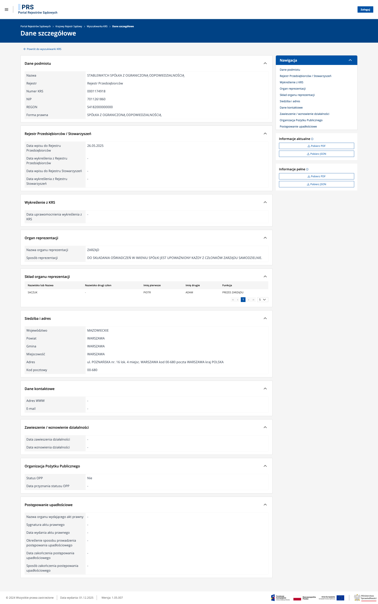
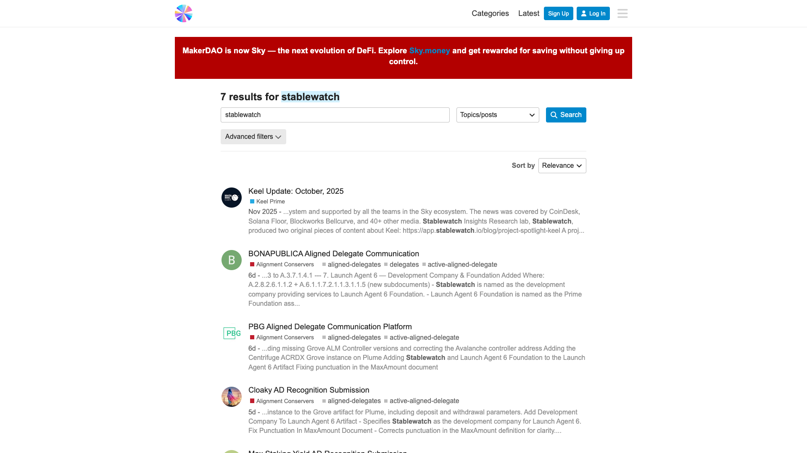
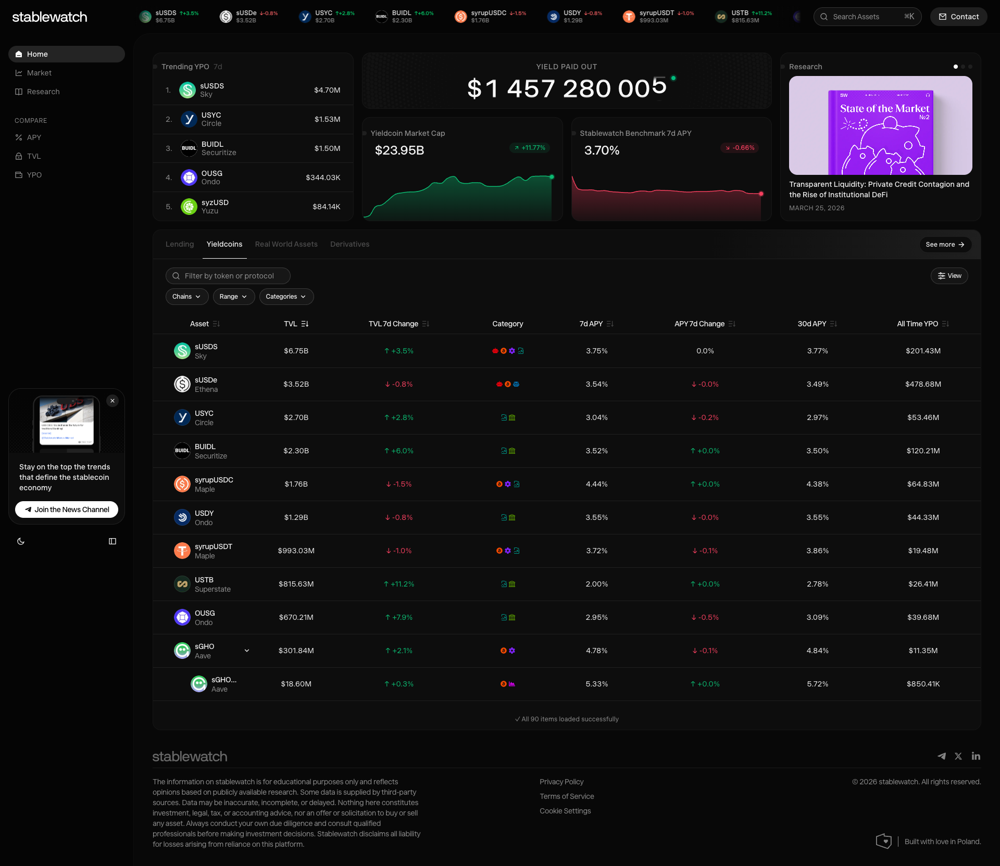

# Stablewatch — Due Diligence Report

**Date:** April 6, 2026
**Status:** Draft
**Related:** [Sky Protocol DD](../sky-protocol/README.md)

---

## 1. Company Overview

Stablewatch is a Warsaw-based analytics and risk advisory firm focused on yield-bearing stablecoins. It provides a public dashboard, a qualitative risk framework, and is building risk infrastructure ("Sky Sentinel") for the Sky Protocol ecosystem.

| Detail | Value | Source |
|---|---|---|
| Legal entity | STABLEWATCH SP. Z O.O. | [KRS 0001174918](legal/krs-odpis-pelny-0001174918.pdf) |
| Registration date | May 26, 2025 | KRS |
| Address | ul. Poznanska 16/4, 00-680 Warsaw | KRS |
| Share capital | 20,000 PLN (~$5,000) | KRS |
| Team size | ~7 | LinkedIn company page |
| Funding | None disclosed | RootData: "Fundraising not disclosed" |
| RootData Transparency | 50% | [RootData](https://www.rootdata.com/Projects/detail/stablewatch) |
| PKD (main activity) | 62.10.B — Software development | KRS |

---

## 2. Ownership — Critical Finding

Full KRS extract attached: [krs-odpis-pelny-0001174918.pdf](legal/krs-odpis-pelny-0001174918.pdf)

### Initial registration (May 26, 2025)

| Shareholder | Shares | Value | Stake |
|---|---|---|---|
| Saczuk Piotr Adam | 274 | 13,700 PLN | 68.5% |
| Czarnecki Jacek Aleksander | 126 | 6,300 PLN | 31.5% |

### After change (December 29, 2025 — KRS entry #5)

| Shareholder | Shares | Value | Stake |
|---|---|---|---|
| Saczuk Piotr Adam | **380** | **19,000 PLN** | **100%** |
| Czarnecki Jacek Aleksander | **Removed** | — | **0%** |

**Board:** Saczuk Piotr Adam — sole member (Prezes Zarzadu). Czarnecki was never on the board.

### What this means

Jacek Czarnecki, who simultaneously holds roles as **Director at Sky Frontier Foundation** and **Senior Advisor to Sky** (both since January 2025, per LinkedIn), was removed as a Stablewatch shareholder on **December 29, 2025**. Three months later, on **March 19, 2026**, Stablewatch announced it had joined the Sky Ecosystem as a core contributor ([source](https://www.stablewatch.io/research/stablewatch-joins-sky-ecosystem-as-core-contributor)).

Czarnecki continues to be listed as "Co-Founder" on LinkedIn and in Stablewatch materials, including the Sky contributor announcement.

This raises questions:
1. Was the ownership change made to resolve a formal conflict of interest before the Sky partnership?
2. What is Czarnecki's current operational role at Stablewatch without equity?
3. Who at Sky approved Stablewatch as a core contributor, and did Czarnecki participate in that decision?

No governance proposal for Stablewatch's onboarding was found on [forum.skyeco.com](https://forum.skyeco.com) (searched April 6, 2026 — only 7 mentions of "stablewatch", none a formal onboarding proposal).

---

## 3. Team

| Person | Role | Background | Verified |
|---|---|---|---|
| **Piotr Saczuk** | Founder & CEO, 100% owner | BNY Mellon (confirmed, duration unverifiable), Finoa, Aleph Zero | LinkedIn, KRS, [ETHWarsaw bio](https://cfp.ethwarsaw.dev/ethwarsaw-2025/speaker/U3NFCK) |
| **Jacek Czarnecki** | Co-Founder (no equity since Dec 2025) | Harvard Law LLM, MakerDAO Global Legal Counsel (2018-2021), L2BEAT COO & Co-Founder (2021-2024). Currently: Director Sky Frontier Foundation, Senior Advisor to Sky. | LinkedIn, RootData, KRS |
| **Piotr Kabacinski** | Head of Research | PhD Ultrafast Spectroscopy, Politecnico di Milano. DeFi investor at Geometry & Synergis Capital VCs. | LinkedIn, [Politecnico profile](https://re.public.polimi.it/cris/rp/rp94422), Google Scholar |
| **Jagoda Anusiewicz** | Director of Operations | COO ETHWORKS (6 mo), Head of Ops ETHWORKS (2 yr), Co-Founder ETHWarsaw. | LinkedIn |
| **Mateusz Radej** | Technical Ops/QA | IT systems background | LinkedIn (limited public data) |

### Team credentials claim

The Sky contributor announcement states the team has *"significant experience across financial markets and digital assets at BNY Mellon, State Street Bank, Chatham Financial, ConsenSys, DeFiLlama, and OKX Wallet."*

- **BNY Mellon:** Confirmed for Saczuk (ETHWarsaw speaker bio). Exact duration not publicly verifiable.
- **State Street Bank, Chatham Financial:** No team member publicly identified with these firms among the 7 known employees.
- **ConsenSys, DeFiLlama, OKX Wallet:** Not attributed to named individuals in public sources. May refer to team members without public LinkedIn profiles.

---

## 4. Products

### Analytics Dashboard

URL: [stablewatch.io/analytics](https://www.stablewatch.io/analytics)
Note: `app.stablewatch.io` does not resolve (DNS error). The dashboard is at the main domain.

| Metric | Value | Date |
|---|---|---|
| Yield Paid Out (all-time) | $1,457,280,005 | Apr 6, 2026 |
| Stablecoin Market Cap tracked | $23.95B | Apr 6, 2026 |
| Stablewatch-reported sUSDS APY | 3.70% | Apr 6, 2026 |

The dashboard is **publicly accessible with no paywall**. No "Pro" tier or restricted features were observed. Tracked tokens include: sUSDS ($6.75B), sUSDe ($3.52B), USYC ($2.70B), BUIDL ($2.30B), syrupUSDC ($1.76B), USDY ($1.29B), syrupUSDT ($993M), USTB ($816M), OUSG ($670M), sGHO ($302M), and 10+ more.

The claim of "over $20 billion in onchain yield assets" appears consistent with the dashboard data ($23.95B tracked), though it is self-reported and not independently audited.

### Risk Framework: "Beyond APY"

Published: [August 5, 2025](https://www.stablewatch.io/blog/risk-framework-for-yield-bearing-stablecoins)

Categorizes yield-bearing stablecoins into 9 types (Tranched, Algorithmic, Managed, Exotic On-Chain, YBS Wrappers, Delta-Neutral, Crypto-Backed, Treasuries-Backed, RWA-Backed) and evaluates 10 risk vectors (Governance/DAO, Custodian, Counterparty, Misallocation, Bridge Risk, Cost Bleed, Gas & Network, Liquidations & Oracles, Controller's Wallet, DeFi Hacks).

The framework explicitly states: *"Our objective is not to assign ratings or scores, as in this rapidly evolving market... traditional rating methodologies could provide a false sense of security."*

### Sky Sentinel

Announced March 19, 2026. Two modules planned:

1. **Verify** — Real-time NAV consolidation for all Sky Agent positions
2. **Settlement** — Auditable accounting standard across the Sky ecosystem

**Status: Not in production.** The stablewatch.io homepage shows "Coming Soon" for the Sky section. The announcement states: *"More details on the methodology will be shared in the coming months."*

The risk methodology underpinning Sky Sentinel has not been published. For a firm providing risk infrastructure to an [$12.29B ecosystem](../sky-protocol/README.md#3-collateral-composition), this is a significant transparency gap.

---

## 5. Sky Relationship

Stablewatch's primary engagement is with Sky Protocol (see [Sky Protocol DD](../sky-protocol/README.md)).

| Detail | Value |
|---|---|
| Role | "Core contributor" to Sky Ecosystem |
| Announcement | [March 19, 2026](https://www.stablewatch.io/research/stablewatch-joins-sky-ecosystem-as-core-contributor) |
| Project | Sky Sentinel (Verify + Settlement modules) |
| Governance approval | No formal governance proposal found on forum.skyeco.com |
| Commercial terms | Not publicly disclosed |
| Rune Christensen endorsement | *"The Stablewatch team have shown great value as contributors to the Sky Ecosystem"* (stablewatch.io homepage) |

### Dependency risk

If Sky Protocol is the primary (or sole) revenue source, and the commercial terms are tied to Czarnecki's dual positioning within Sky, then a change in either relationship (Czarnecki's Sky roles or the Sky-Stablewatch contract) could materially impact the business.

---

## 6. Competitive Context

| Dimension | Stablewatch | Gauntlet | Chaos Labs |
|---|---|---|---|
| Focus | YBS yield analytics + risk advisory | DeFi economic security | DeFi risk management + oracles |
| Team size | ~7 | ~66 | ~45 |
| Funding | Undisclosed (20K PLN capital) | $25M+ | $75M |
| Methodology | Qualitative framework (published). Quantitative model (not published). | Published simulation models | Published risk reports |
| Key client | Sky Protocol | Aave, Compound, Morpho | Aave, GMX, dYdX |

Stablewatch occupies a **different niche** than Gauntlet/Chaos Labs. Those firms optimize protocol-level parameters (collateral factors, interest curves). Stablewatch focuses on stablecoin yield comparison and risk categorization.

Closer comparators: DeFiLlama (free, open-source, much broader coverage), StableLens (stablecoin intelligence with pricing tiers).

---

## 7. Transparency Assessment

| Dimension | Status | Detail |
|---|---|---|
| Risk methodology | Not published | "Coming months" since March 2026 |
| YPO calculation | Not documented | Described conceptually only |
| Data sources | Not documented | No info on RPCs, indexers, oracles used |
| Funding | Not disclosed | RootData 50% transparency |
| Pricing | Not disclosed | No pricing page exists |
| Code | Closed source | No open-source components |
| Czarnecki's exit | Not disclosed | KRS shows removal Dec 2025; not mentioned publicly |
| SOC 2 / ISO 27001 | None | No certifications, SLAs, or status page |

---

## 8. Questions for Founders

### #0 — Critical (KRS finding)

Jacek Czarnecki was removed as shareholder on December 29, 2025 (KRS entry #5). Three months later, Stablewatch announced the Sky partnership where Czarnecki simultaneously holds Director and Senior Advisor roles. Specifically:

- Why did Czarnecki sell/transfer 100% of his shares?
- Was this to resolve a conflict of interest before the Sky partnership?
- What is Czarnecki's current operational role without equity?
- Why does public material still list him as "Co-Founder" without disclosing the ownership change?
- Who at Sky approved Stablewatch as a core contributor? Did Czarnecki participate in that decision?

### Business model

1. Dashboard is free — what generates revenue? What is the Sky / advisory / other split?
2. Is the company bootstrapped or externally funded? What is the runway?
3. What are the exact commercial terms with Sky?
4. What is the client diversification plan beyond Sky?

### Product

5. When will the Sky Sentinel risk methodology be published?
6. How exactly is "Yield Paid Out" calculated? Data sources, chains covered, update frequency?
7. What is the production status of Verify and Settlement modules?
8. What is the data infrastructure? Own nodes, external RPCs, indexers?

### Enterprise readiness

9. SOC 2 / ISO 27001 timeline?
10. Who specifically on the team worked at State Street Bank and Chatham Financial?

### Sky-specific risks

11. How do Verify/Settlement address the lack of independent reserve audits for USDS? (See [Sky Protocol DD, Section 6](../sky-protocol/README.md#6-regulatory-status))
12. How do you model a bank run on sUSDS given [77.6% of USDS is locked there](../sky-protocol/README.md#2-susds--savings-token-mechanism)?
13. How do you assess the [USDS contract upgradeability](../sky-protocol/README.md#contract-risk-note) for institutional clients?
14. How do you assess Sky governance risk after the [February 2025 emergency vote](../sky-protocol/README.md#february-2025-emergency-vote)?

---

## 9. Files in this directory

| File | Description |
|---|---|
| [README.md](README.md) | This report |
| [legal/krs-odpis-pelny-0001174918.pdf](legal/krs-odpis-pelny-0001174918.pdf) | Full KRS extract (7 pages), April 6, 2026 |
| [legal/krs-details-screenshot.png](legal/krs-details-screenshot.png) | KRS web interface screenshot |
| [legal/krs-search-results.png](legal/krs-search-results.png) | KRS search results |
| [screenshots/stablewatch-analytics-dashboard.png](screenshots/stablewatch-analytics-dashboard.png) | Dashboard (1920x1080) |
| [screenshots/stablewatch-homepage.png](screenshots/stablewatch-homepage.png) | Homepage |
| [screenshots/sky-forum-search-stablewatch.png](screenshots/sky-forum-search-stablewatch.png) | Sky Forum search results |

---

*Report prepared April 6, 2026. KRS data from ekrs.ms.gov.pl. Dashboard data from stablewatch.io.*
*See also: [Sky Protocol DD](../sky-protocol/README.md)*
